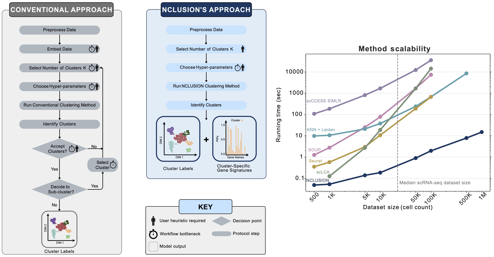

# Nonparametric CLUstering of SIngle cell PopulatiONs (NCLUSION)

## Introduction

Clustering is commonly used in single-cell RNA-sequencing (scRNA-seq) pipelines to characterize cellular heterogeneity. However, current methods face two main limitations. First, they require user-specified heuristics which add time and complexity to bioinformatic workflows; and, second, they rely on post-selective differential expression analyses to identify marker genes driving cluster differences which has been shown to be subject to inflated false discovery rates. In this repository, we present a solution to those challenges by introducing "nonparametric clustering of single-cell populations" (NCLUSION): an infinite mixture model that leverages Bayesian sparse priors to simultaneously identify marker genes while performing clustering on single-cell expression data. NCLUSION uses a scalable variational inference algorithm to perform these analyses on datasets with up to millions of cells. In this package and corresponding [documentation](https://microsoft.github.io/nclusion/) we demonstrate that NCLUSION (i) matches the performance of other state-of-the-art clustering techniques with significantly reduced runtime and (ii) provides statistically robust and biologically-relevant transcriptomic signatures for each of the clusters it identifies. Overall, NCLUSION represents a reliable hypothesis generating tool for understanding patterns of expression variation present in single-cell populations.

## The Method

NCLUSION uses a sparse hierarchical Dirichlet process normal mixture model to reduce the number of choices that users need to make while simultaneously performing variable selection to identify top cluster-specific marker genes for downstream analyses. There are three key components to NCLUSION. First, NCLUSION is fit directly on single-cell expression matrices and does not require the data to be embedded within a lower-dimensional space. Second, it assumes that cells can belong to one of infinitely many different clusters. This is captured by placing a Dirichlet process prior over the cluster assignment probabilities for each cell. By always setting the number of possible clusters _K_ = &infin;, we remove the need for users to have to iterate through different values until they find the optimal choice. Instead, NCLUSION uses a stick-breaking proccess to naturally allow for more clusters as the amount of variation in a single cell dataset grows. Third, NCLUSION assumes that not all genes are important when assigning cells to a given cluster. To model this, we place a spike and slab prior on the mean expression of each gene within each cluster. This prior shrinks the mean of genes that play an insignificant role in cluster formation towards zero. The learning of the model parameters is done via a variational-EM algorithm that allows the method to scale with the number of
cells in the data.

## Installation

This package requires that Julia 1.8+ and its dependencies are installed.
Instructions for installation can be found <a
href="https://julialang.org/" class="external-link"> here. </a>

 <b>To create a new Julia project environment and install the NCLUSION package, follow these steps:</b>

<ol><li> Start a Julia session by entering <code>julia</code> in a bash terminal while in
your working directory.</li> <li>  Enter a Julia Pkg REPL by pressing the right square bracket <code>]</code>.
  Create a new Julia project environment by typing <code>generate</code> followed by the name of your project (i.e. <code>generate nclusion_demo</code>). This creates a project
  directory named after the environment you created, and two files: <code>Project.toml</code>
  and <code>Manifest.toml</code>.
  These files, which can be found in the project
directory, specify the packages that are downloaded in the environment.</li>
<li>Activate the project environment in the Julia Pkg REPL by typing <code>activate</code>
followed by the name of the Julia environment (i.e. <code>activate
nclusion_demo</code>).</li> <li>Install NCLUSION in the project environment, by running the following command in the
  Julia Pkg REPL:<pre><code>add Nclusion</code></pre> You can exit the Julia Pkg REPL by typing <code>Ctrl + C</code>, and
  the Julia REPL by entering <code>exit()</code>.</li></ol>
 

 
<b>To install NCLUSION into an existing Julia project environment, follow these steps:</b>

  
<ol><li>Activate the project environment and start a Julia REPL by entering <code>julia --project=/path/to/julia/env --thread=auto</code> into a bash terminal, where <code>--project</code> is set equal to the path to your existing Julia project environment.</li>
  <li>Install NCLUSION in the activated project environment by entering the
  following command in the Julia REPL: <pre><code>using Pkg;Pkg.add("Nclusion")</code></pre>
  You can exit the Julia Pkg REPL by typing <code>Ctrl + C</code>, and
  the Julia REPL by entering <code>exit()</code>.</li></ol>

<b>Alternatively, you can install NCLUSION directly using git by following these steps: </b>

<ol><li>Enter the following command into a bash terminal: 
  <pre><code>git clone git@github.com:microsoft/Nclusion.jl.git
cd nclusion/</code></pre></li>
<li>Now start a Julia session by entering the command: <pre><code>julia</code></pre></li><li>In the Julia REPL, type <code> ] </code>. This command starts the Pkg REPL. In this Pkg REPL, type the following Julia command: <pre><code>activate .</code></pre> This activates the Nclusion environment. You can verify that the environment is active if the new Pkg REPL prompt  is <code>(Nclusion) pkg></code>.
</li><li>Now type the following commands in the in the Pkg REPL: <pre><code>instantiate
precompile</code></pre>This completes the installation process. You can exit the Julia Pkg REPL by typing <code>Ctrl + C</code>, and the Julia REPL by entering <code>exit()</code>.</li></ol>

## Software Package Documentation, Examples, and Tutorials

Documentation for the NCLUSION software package, examples, and tutorials can be found [here](https://microsoft.github.io/nclusion).

## Relevant Citations

C. Nwizu, M. Hughes, M. Ramseier, A. Navia, A. Shalek, N. Fusi, S. Raghavan, P. Winter, A. Amini, and L. Crawford. Scalable nonparametric clustering with unified marker gene selection for single-cell RNA-seq data. _bioRxiv_. https://doi.org/10.1101/2024.02.11.579839

## Questions and Feedback

If you have any questions or concerns regarding NCLUSION or the tutorials, please contact <a href="mailto:chibuikem_nwizu@brown.edu"> Chibuikem Nwizu</a>, <a href="mailto:v-mahughes@microsoft.com"> Madeline Hughes</a>, <a href="mailto:ava.amini@microsoft.com"> Ava Amini</a>, or <a href="mailto:lcrawford@microsoft.com"> Lorin Crawford</a>. Any feedback on the repository, manuscript, and tutorials is appreciated.

## Contributing

This project welcomes contributions and suggestions.  Most contributions require you to agree to a
Contributor License Agreement (CLA) declaring that you have the right to, and actually do, grant us
the rights to use your contribution. For details, visit https://cla.opensource.microsoft.com.

When you submit a pull request, a CLA bot will automatically determine whether you need to provide
a CLA and decorate the PR appropriately (e.g., status check, comment). Simply follow the instructions
provided by the bot. You will only need to do this once across all repos using our CLA.

This project has adopted the [Microsoft Open Source Code of Conduct](https://opensource.microsoft.com/codeofconduct/).
For more information see the [Code of Conduct FAQ](https://opensource.microsoft.com/codeofconduct/faq/) or
contact [opencode@microsoft.com](mailto:opencode@microsoft.com) with any additional questions or comments.

## Trademarks

This project may contain trademarks or logos for projects, products, or services. Authorized use of Microsoft 
trademarks or logos is subject to and must follow 
[Microsoft's Trademark & Brand Guidelines](https://www.microsoft.com/en-us/legal/intellectualproperty/trademarks/usage/general).
Use of Microsoft trademarks or logos in modified versions of this project must not cause confusion or imply Microsoft sponsorship.
Any use of third-party trademarks or logos are subject to those third-party's policies.

